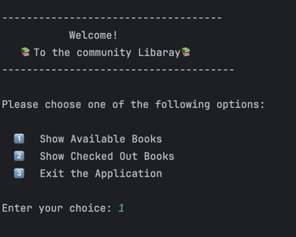
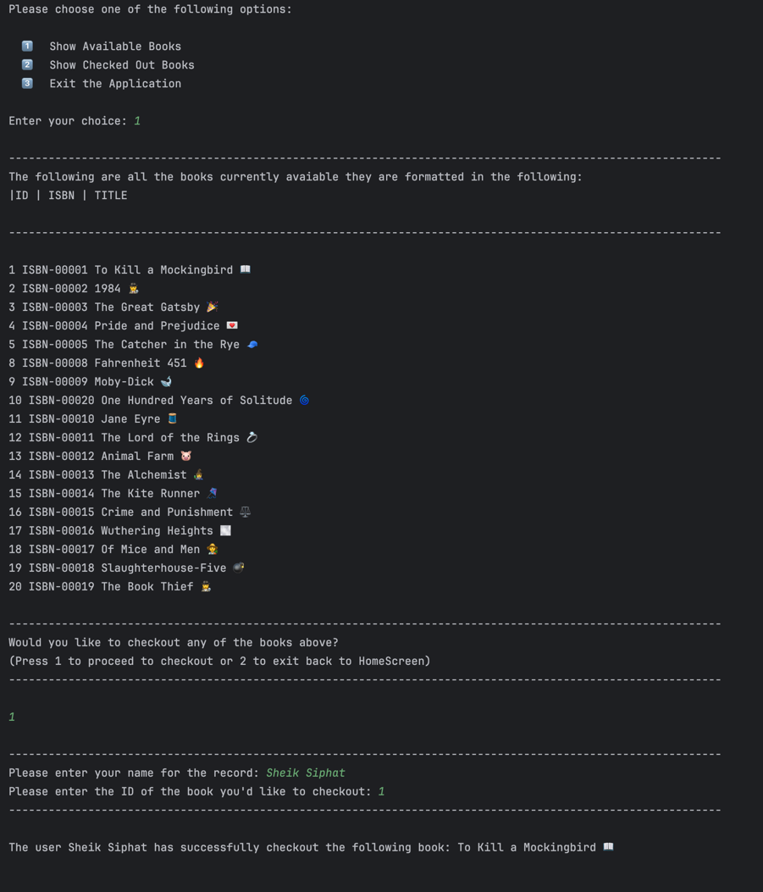
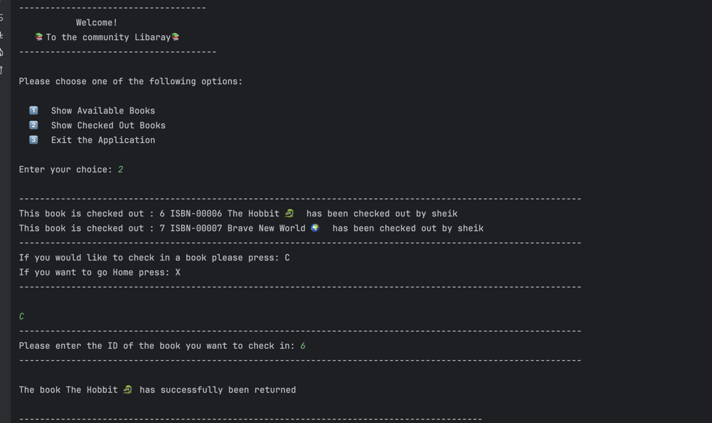
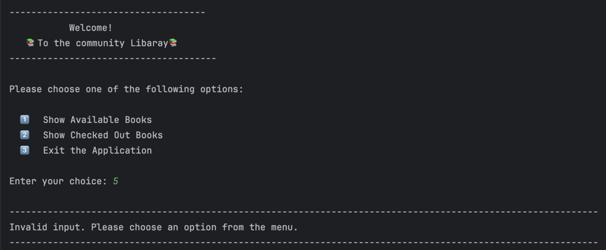

# 📚 Neighborhood Library System

Welcome to the Community Library CLI App!  
This simple Java console application simulates a small neighborhood library system where users can check out and check in books.

---

## 💡 Features

- View available books with ID, ISBN, and title
- Emoji-enhanced book listings 📖
- Check out books by entering your name and the book's ID
- Check in books that are currently checked out
-  clean interface for a better terminal experience 🎨

---

## 🖥️ Screenshots

### 🏠 Home Screen

### 📚 Available Books & Checkout a book 

---

### 📚 Checked out Books and Check in Books

---

## ✋ Error Handling
This application includes error checking for invalid user inputs:

❌ Invalid menu choices (e.g., entering "5" on the main menu)

The app will respond with:

### The app is perpetually looking for inputs as it is loop based. If an incorrect input is given the user has the oppurtunity to input the correct one

### 🤔Interesting piece of code:
The following code was interesting to me as I've learned that when you break out of a switch case, it goes back to the default. So it is essntially a if statement encased with a for loop. I found this to be really interesting for this project because it helped me make the library be dynamic so the user can go back an dforth itnot the differnt options without the code stoping.
switch (choice){
case 1:
int proceedToCheckout = 0;
while (proceedToCheckout != 2) {
showAvailableBooks(inventory);

                        System.out.println("\n------------------------------------------------------------------------------------------------------------");
                        System.out.println("Would you like to checkout any of the books above?");
                        System.out.println("(Press 1 to proceed to checkout or 2 to exit back to HomeScreen)");
                        System.out.println("------------------------------------------------------------------------------------------------------------\n");

                        proceedToCheckout = scanner.nextInt();
                        scanner.nextLine();
                        if (proceedToCheckout == 1) {

                            System.out.println("\n------------------------------------------------------------------------------------------------------------");
                            System.out.print("Please enter your name for the record: ");
                            String userName = scanner.nextLine();

                            System.out.print("Please enter the ID of the book you'd like to checkout: ");
                            int checkoutBookID = scanner.nextInt();
                            scanner.nextLine();
                            System.out.println("------------------------------------------------------------------------------------------------------------\n");

                            checkOutBook(inventory, checkoutBookID, userName);
                        }
                    }
                    break;
                case 2:
                    System.out.println("\n------------------------------------------------------------------------------------------------------------");
                    showCheckedOutBook(inventory);
                    System.out.println("------------------------------------------------------------------------------------------------------------");
                    System.out.println("If you would like to check in a book please press: C");
                    System.out.println("If you want to go Home press: X");
                    System.out.println("------------------------------------------------------------------------------------------------------------\n");

                    String checkoutOrHome = scanner.nextLine();

                    if (checkoutOrHome.equals("C")){
                        System.out.println("------------------------------------------------------------------------------------------------------------");
                        System.out.print("Please enter the ID of the book you want to check in: ");
                        int checkInBookId = scanner.nextInt();
                        scanner.nextLine();
                        System.out.println("------------------------------------------------------------------------------------------------------------\n");

                        checkInBook(inventory,checkInBookId);
                        showCheckedOutBook(inventory);
                    }
                    break;
                case 3:
                    System.out.println("\n------------------------------------------------------------------------------------------------------------");
                    System.out.println("You have chosen to exit the application. Goodbye!");
                    System.out.println("------------------------------------------------------------------------------------------------------------\n");
                    return;
                default:
                    System.out.println("\n------------------------------------------------------------------------------------------------------------");
                    System.out.println("Invalid input. Please choose an option from the menu.");
                    System.out.println("------------------------------------------------------------------------------------------------------------\n");
                    break;
            }
        }
    }